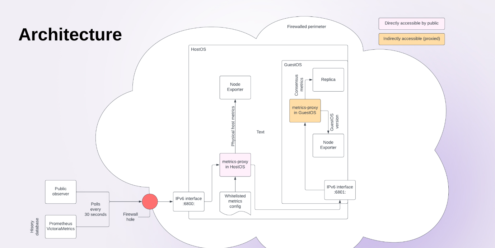

# IC observability stack

This collection of software lets you use your own equipment to observe the
health and operation of the Internet Computer, or parts thereof.  It is
a code-first, fully automated, DevOps-oriented stack that lets you create
and manage your own personal view into the workings of the Internet Computer.

This stack can run either locally in a VirtualBox virtual machine, or in
a remote machine designated by you.

For usage instructions, see below under heading *Usage*.

## How does this work?

IC nodes emit metrics on certain HTTP ports, which can be scraped by
telemetry agents.  The architecture of how the metrics flow from
nodes to observability stack -- under the standard *proxied mode*
-- is designed as follows:



This stack also supports *direct mode* (not visualized in the diagram
above), in case the firewall of your IC nodes permits direct access
to your instance of the stack.

## Prerequisites

* IPv6 connectivity.
  * If you plan to run the stack as a local VirtualBox VM, your local
    network and machine must have working IPv6 networking.
  * If you plan to run the stack in a remote machine (which will be
    configured via SSH), the remote machine must have working IPv6
    networking.
  * In both cases, tests for IPv6 connectivity will be conducted at
    the end of the provisioning step.
* Root-equivalent access on your workstation, to deploy the software
  this stack needs to be set up.
* If you plan to run this stack in a remote machine, the user account
  you log onto this machine with must have root-equivalent access via
  `sudoers`, and should be running an Ubuntu LTS machine or a recent
  Fedora release.

## Preparation

Clone this repository on your workstation.  You can fork this repository
too, but if you do, make it private at once, to protect key credentials
stored in this repository.  You are encouraged to keep a backup copy
of the repository somewhere, in order to be able to restore your settings
in case your workstation fails.

> ℹ️ To check in secrets securely, consider using a credentials management
> application compatible with Ansible to store any credentials in your
> fork of this repository.

Once you have a local clone of this, using a terminal application, change
into its folder.

Run `./bootstrap.sh`.  The program will require your administrative password
(usually your local user's password) to set up the software necessary to
manage your observability stack.  **Follow the onscreen instructions as
the playbook executes.**

## Setup

Once your system is prepared, configure where the playbooks will operate.
The following command will run wizard will let you decide whether you'll
use a preexisting machine you can SSH into, or create a locally-provisoned
virtual machine using Vagrant and VirtualBox (the default).  Run:

```sh
python3 configure.py
```

Once the provisioning configuration step is done, create your scrape
configuration variable `scrape_configs`.  This configuration will be used
to let the observability stack know which targets to obtain telemetry from.
See the documentation [on scrape configuration](doc/scrape-configs.md) for
more information on how to describe these targets.

With the scrape configuration in place, set up the stack by running:

```sh
ansible-playbook -v playbooks/prepare-node.yml
```

> This command can be run multiple times, with only necessary changes
> being re-applied each time.  Whenever you change settings of your
> stack within this repository, you should re-run the command to
> ensure the settings are applied and take effect.

* If you selected Vagrant provisioning in the previous step:
  * This will provision a 2.5 GB RAM, 50 GB storage virtual Ubuntu instance
    on your machine, where the observability stack will be set up.
  * The machine will be rebooted after updates.
  * K3s will be provisioned.
* In any other case:
  * The remote machine will update and reboot.
  * K3s will be deployed on the remote machine after that.

Once K3s is deployed, an instance of Prometheus will be deployed onto
the observability stack node, and all the telemetry targets will be
configured.

Roughly 4 minutes after this process is done, Prometheus should be
successfully obtaining telemetry data from the targets.

## Usage

### Access to services of the stack

Once the stack is set up, you will be able to access Prometheus on HTTP
port 32090 of the target machine, and Grafana on HTTP port 32091:

* If deploying via VirtualBox, the host name will be localhost, as the
  service TCP ports will be locally forwarded.
* If deploying on a remote machine via SSH, you will have to access the
  services via SSH port forwarding.
  * Note that the service ports will be running unsecured by TLS and,
    generally, firewall rules will not permit access to these ports
    remotely.
  * If you want to access the services without port forwarding, you
    should deploy a proxy service with support for an HTTPS provider
    such as Let's Encrypt, then use the proxy service to reverse-proxy
    the ports listed below onto the standard HTTPS 443 port exposed by
    the reverse proxy to the public.  Make sure to also instruct the
    proxy service to add some form of authentication since Prometheus
    does not support authentication.
  * Port forwarding is usually accomplished by a command line similar to
    `ssh -L 32090:localhost:32090 -L 32091:localhost:32091 <user@ip address>`.
    When port forwarding, all software running on your client machine can
    access the ports remotely forwarded by SSH.
  * In the future, we plan to offer automated, authenticated SSL
    support for stacks deployed in this way, ensuring no SSH port
    forwarding is necessary.

Assuming a local VirtualBox VM or SSH port forwarding is active, the
URLs to access the various services are:

* Prometheus: `http://localhost:32090/`.
* Grafana: `http://localhost:32091/`.

### Querying data in Prometheus

The stack can be queried using the standard URL `http://localhost:32090/graph`
— a screen that lets you enter
[PromQL queries](https://prometheus.io/docs/prometheus/latest/querying/basics/)
at will.

Try these sample queries:

* `up`
* `power_average_watts`

### Updating the scrape configuration

Whenever you want to update the scrape configuration, you can change
the appropriate `scrape_configs.yml` file and then run this command:

```sh
ansible-playbook -v playbooks/prepare-node.yml -t scrape_configs
```

This will run only the parts of the playbook that configure the
scraping on Prometheus, and nothing more.  It will certainly be much
faster, and it will skip rebooting the target machine when updates
are applied.

Be patient and remember to wait a couple of minutes for Prometheus
to reload its scrape configuration from disk.

More information about scrape configs can be found in
[the scrape configs documentation](doc/scrape-configs.md).

### Accessing Grafana dashboards

Grafana has in-built authentication.  The default credentials to access
the Grafana service are defined in file [vars/grafana.yml](vars/grafana.yml);
you should change them right away.  It's better to change the credentials
directly in the file, and apply the stack settings again.  To apply Grafana
configuration only, run:

```sh
ansible-playbook -v playbooks/prepare-node.yml -t grafana
```

This repository ships several default common-sense dashboards.  Feel free
to peruse them through the Grafana dashboard list.

### Provisioning your own dashboards

> This requires familiarity with managing Grafana dashboards,
> and the concepts related to these tasks.

To provision and persist your own dashboard:

1. Obtain the JSON model of the dashboard you want to provision
   (Instructions below).
1. Optionally, create a folder under `definitions/grafana-dashboards`
   for your dashboard.
2. In any subfolder under `definitions/grafana-dashboards` of your
   choice, save the JSON content under a file name that ends in
   `.json`.

Then run this command to create the newly-deployed dashboard:

```sh
ansible-playbook -v playbooks/prepare-node.yml -t dashboards
```

You can then check in your new dashboard into your clone of the
IC observability stack repository if you so choose.

To obtain the JSON source of a dashboard you have manually created,
navigate to your dashboard's settings (cog icon at the top right)
then click on *JSON model* to obtain and copy the JSON source.

The stack manages each dashboard's Grafana UID so you don't have
to worry about dashboard names colliding with each other.  To that
effect, the UID you set up in your dashboard files will be overridden
by the stack.  The folder under which the dashboard will appear in
Grafana is dictated by the folder name it is stored in, under
`definitions/grafana-dashboards`.

The Grafana operator does not like it when existing dashboards
provisioned via JSON are modified, and will constantly attempt to
redeploy modified dashboards to match their original source.  If
you want to modify an existing dashboard (for later use), duplicate
the existing dashboard, change its UID (via the JSON model), then
make all the changes you want.  To persist your changes in the copy,
use the process described above; once done, the persisted dashboard
will appear with the same name, but under the folder you chose to save
it into.  Note that the persisted dashboard will have a different UID
than the manually-edited dashboard, so you may want to delete the
manually-edited dashboard after you are done persisting it.

## Troubleshooting

### Debugging Vagrant-provisioned VMs

You can SSH into the Vagrant-provisioned VM by running the following
commands in the repository folder:

```sh
cd vagrant
vagrant ssh observability
```

This should get you logged into the virtual machine.  You can `sudo`
without a password within the VM.

If you get an error noting:

```
The provider 'virtualbox' that was requested to back the machine
'observability' is reporting that it isn't usable on this system.
```

you most likely need to re-bootstrap, so follow the instructions
under the *Preparation* heading.

If, conversely, you get an error noting:

```
A Vagrant environment or target machine is required to run this
command. Run `vagrant init` to create a new Vagrant environment.
```

then follow the *Setup* instructions above (ensuring that you
have selected Vagrant as the provisioning mechanism).

To start over, you can ask Vagrant to clean up the VM:

```sh
cd vagrant
vagrant destroy
# Confirm your desire in the prompt that appears.
```

### Telemetry targets and Prometheus configuration

Inspect which telemetry targets have been set up by browsing to the
Prometheus instance (example address: `http://localhost:32090/`), then
click on *Status* on the top bar, then click on *Targets*.  A list
should appear onscreen with the list of targets being monitored by
your observability stack, with their up/down status.

Just like the active targets appear under URL path `/targets`, the
active prometheus configuration should be accessible at URL path
`/config` of the same URL.

## License

This software is distributed under the provisions of the
[Apache 2.0 license](./LICENSE).

## Contributions

We appreciate anyone who wants to contribute to this project.  The DFINITY
Foundation makes the code of this metrics-proxy available to the public
under the Apache 2.0 license.

Contributions can be made under the standard Github pull request model,
with one caveat: first-time contributors will need to undergo our
[CLA](https://github.com/dfinity/cla) process to ensure that the legal
rights of other developers under the license are protected.
